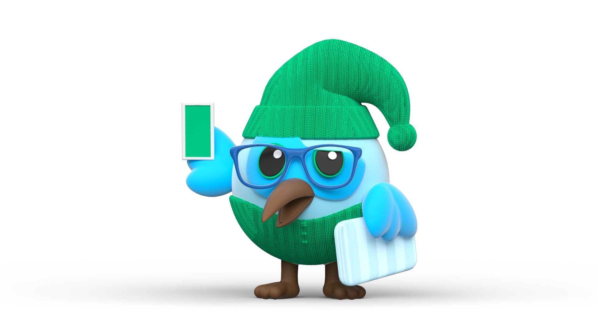

<h1 align="center">Hola , I'm FavourTy</h1>
<h3 align="center">A flutter developer</h3>

 
  
  

 # :woman_technologist: About Me

- 👀 I’m interested in **living soft life**
  
- 🌱 I’m currently learning **C++, Flutter, OOP and  DSA**
  
- ✨ Ask me about **Flutter, Dart and Time travel**
  
- 💞️ I’m looking to collaborate on **Open Source projects**
  
- 📫 How to reach me **favouradetayo03@gmail.com**
  
- 💥 Fun Fact **I live in a different reality than the rest of you. One where Time Travel is real 🏹**
---

### :hammer_and_wrench: Languages and Tools :

  &nbsp;
  &nbsp;
  &nbsp;
    
   
   
   
    

 
 
# 🚀 Status:
  
 

 
 
 

<!---
FavourTy/FavourTy is a ✨ special ✨ repository because its `README.md` (this file) appears on your GitHub profile.

You can click the Preview link to take a look at your changes.
--->
